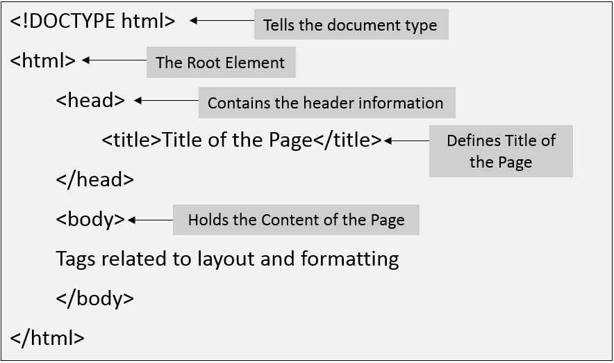

# Introduction to HTML

## What is HTML

HTML (Hypertext Markup Language) is a markup language used to structure the content of a website.
It is used to create the structure of a website, including

- headings
- paragraphs
- lists
- Images
- links, and more.

## Structure of HTML

1. `DOCTYPE` declaration: This specifies the version of HTML being used in the document.
2. `<html>` element: This is the root element of the document, and all other elements are contained within it.
3. `<head>` element: This contains meta-information about the document, such as the title of the page and links to CSS and JavaScript files.
4. `<body>` element: This contains the content of the document, such as text, images, and links.

Figure 2.1: Structure of HTML


## Basic Syntax of HTML

An element is a piece of content represented by a pair of tags.
The opening tag contains the element name, and the closing tag has a forward slash before the element name.
Example-

```html
<div>This is the normal text</div>
```

An attribute is used to provide additional information about an element and is added within the opening tag of the element.
Example -

```html
<a href="https://example.com">this is a link </a>
```

some elements are self-closing, like `` or `<br>` which means they don't have closing tags.
Example -

```html

```

## Some Important Tags

1. Heading Tags
   headings are defined using the `<h1>` through `<h6>` elements. These elements are used to create headings of different levels, with `<h1>` being the highest level (most important) and `<h6>` being the lowest level (least important).

Example

```html
<h1>heading level 1</h1>
<h2>heading level 2</h2>
<h3>heading level 3</h3>
<h4>heading level 4</h4>
<h5>heading level 5</h5>
<h6>heading level 6</h6>
```

2. div Tag
   The `<div>` tag in HTML stands for "division" and is used to group together other HTML elements.

It is a block-level element, which means it takes up the full width of its parent container and creates a new block formatting context.

Example

```html
<div class="nav__items">
  <a href="#">Home</a>
  <a href="#">About</a>
  <a href="#">Projects</a>
  <a href="#">Contact</a>
</div>
```

3. Anchor tag
   The `<a>` (anchor) tag in HTML is used to create a hyperlink to other web pages or to specific locations within the same page. It is used to navigate between web pages or within a single page.
   Example

   ```html
   <a href="https://example.com">this is a link </a>
   ```

4. Form tag
   The `<form>` tag in HTML is used to create a form that can be submitted to a server. It encloses all the form controls such as text fields, checkboxes, radio buttons, and more that are used to gather user input.

Example:

```html
<form>
  <!-- form control start from here -->
</form>
```

5. Input Tag
   The `<input>` tag in HTML is used to create various types of form controls, such as text fields, checkboxes, radio buttons, and more. It is used within a `<form>` element to gather user input.
   The `<input>` tag has a type attribute that specifies the type of form control to be created.
   Example

```html
<form>
  <label for="name">Name:</label>
  <input type="text" id="name" />
</form>
```

Types of input elements include:

- type="radio" for radio buttons
- type="text" for text input
- type="checkbox" for checkboxes
- type="submit" for submit buttons
- type="reset" for reset buttons
- type="password" for password fields
- type="file" for file uploads
- type="hidden" for hidden fields

6. Ordered List Tag
   An ordered list is created using the <ol> (ordered list) tag, and each list item is defined using the <li> (list item) tag. The list items are automatically numbered.
   Example

```html
<ol>
  <li>First item</li>
  <li>Second item</li>
  <li>Third item</li>
</ol>
```

7. Unordered List Tag
   An unordered list is created using the <ul> (unordered list) tag, and each list item is defined using the <li> tag. The list items are represented by bullet points.
   Example

```html
<ul>
  <li>First item</li>
  <li>Second item</li>
  <li>Third item</li>
</ul>
```

8. img tag
   The `` tag in HTML is used to embed images in a web page.
   Example

   ```html
   
   ```

   - src (required) - The URL of the image file.

   - alt (required) - A short text description of the image. This attribute is important for accessibility and should be used to describe the image for users who may not be able to see it.

   - width and height (optional) - The width and height of the image in pixels.

# CSS

## What is CSS

CSS stands for Cascading Style Sheets. It is a style sheet language used to describe the presentation of a document written in markup language. It is used to enhance the visual appeal of a website and make it more user-friendly.

## Linking Style Sheet to HTML

There are 3 ways to link a CSS stylesheet to an HTML document:

1. Internal linking:
   This is when the CSS is written within the `<head>` section of the HTML document using the `<style>` element.

```html
<head>
  <style>
    /* CSS styles go here */
  </style>
</head>
```

2. External linking
   This is when the CSS is written in a separate file and linked to the HTML document using the `<link>` element in the `<head>` section.

```html
<head>
  <link rel="stylesheet" type="text/css" href="styles.css" />
</head>
```

3. Inline linking
   This is when the CSS is written directly within the HTML element using the style attribute.

```html
<p style="color: blue;">This is a blue paragraph.</p>
```

## Structure of CSS

The structure of a CSS stylesheet is made up of selectors, properties, and values.

1. Selectors: Selectors are used to select the HTML elements that the CSS styles will be applied to. Selectors can be based on the element's name, class, or id.

2. Properties: Properties are used to define the aspect of the selected element that will be changed. Properties are written in the form of property: value;

3. Values: Values are used to specify the actual value of the property. Values can be in the form of color names, hex values, rgba values, etc.

```
selector {
    property: value;
    property: value;
    /* more properties and values */
}
```

## Basic Properties in CSS

1. color: This property sets the text color of an element.
   Example: color: blue;

2. background-color: This property sets the background color of an element. Example: background-color: yellow;

3. font-size: This property sets the font size of the text of an element.
   Example: `font-size: 20px;`

4. font-family: This property sets the font family of the text of an element. Example: `font-family: Arial, sans-serif;`

5. text-align: This property sets the alignment of the text within an element. Example: `text-align: center;`

6. width and height: These properties set the width and height of an element. Example: `width: 100px; height: 50px;`

7. border: This property sets the border of an element. Example: `border: 2px solid black;`
8. border-radius: The border-radius property in CSS is used to create rounded corners on elements.
   Example: `border-radius: 20px;`

## Important CSS properties

1. margin: The margin property sets the space outside of an element. It can be set on all four sides of an element using the following properties:

```css
margin-top: value;
margin-right: value;
margin-bottom: value;
margin-left: value;
```

You can also set all four sides at once using the margin property:
`margin: top right bottom left;`

For example, to create a space of 10 pixels around an element:

```css
.my-element {
  margin: 10px;
}
```

Negative values for margin are allowed, but they don't increase the size of the element, they just move it inward.

2. padding: The padding property sets the space inside of an element. It can be set on all four sides of an element using the following properties:

```css
padding-top: value;
padding-right: value;
padding-bottom: value;
padding-left: value;
```

You can also set all four sides at once using the padding property:
padding: top right bottom left;

For example, to create a space of 10 pixels inside an element:

```css
.my-element {
  padding: 10px;
}
```

3. transform
   The transform property in CSS is used to apply a 2D or 3D transformation to an element. This property allows you to rotate, scale, skew, and translate elements on the web page.
   The basic syntax for the transform property is:
   ```css
   transform: function(value);
   ```

Where function can be one or more of the following:

1. translate(x, y): This function moves an element along the x-axis and y-axis. The value of x and y can be specified in pixels, percentages, or any other valid length unit.
   Example

   ```css
   transform: translate(50px, -30px);
   ```

2. rotate(angle): This function rotates an element by a specified angle. The angle value can be specified in degrees, grads, radians, or turns. Example

   ```css
   transform: rotate(45deg);
   ```

3. scale(x, y): This function scales an element along the x-axis and y-axis. The value of x and y can be a number or percentage.
   Example

   ```css
   transform: scale(2, 0.5);
   ```

4. skew(x-angle, y-angle): This function skews an element along the x-axis and y-axis by a specified angle. The angle value can be specified in degrees, grads, radians, or turns.
   Example

   ```css
   transform: skew(10deg, -5deg);
   ```

5. FlexBox in CSS
   FlexBox provides ease to making responsive design. It is used to create the layout of a container.

Creating the flexbox
To create the flexbox we have to set the display property to flex

```css
.container {
  display: flex;
}
```

FlexBox consists of flex-container and flex-items

1. Flex-container
   It is the area that is acquired by the flexbox. By setting the various properties of flex-container we can arrange the items of flex-box.

Properties of Flex-container

1. flex-direction: This property sets the direction of the flex items. It can be set to row, row-reverse, column, or column-reverse. The default value is row.

```css
.container {
  display: flex;
  flex-direction: column;
}
```

2. justify-content: This property aligns the flex items along the main axis. It can be set to flex-start, flex-end, center, space-between, or space-around. The default value is flex-start.

```css
.container {
  display: flex;
  justify-content: center;
}
```

3. align-items: This property aligns the flex items along the cross-axis. It can be set to flex-start, flex-end, center, baseline, or stretch. The default value is stretch.

```css
.container {
  display: flex;
  align-items: baseline;
}
```

4. align-content: This property aligns the flex lines along the cross-axis, when there are multiple lines of flex items. It can be set to flex-start, flex-end, center, space-between, space-around, or stretch. The default value is stretch.

```css
.container {
  display: flex;
  align-content: space-between;
}
```

5. flex-wrap: If there is not enough space for the flex elements on one flex line, specify whether they should wrap or not. It can be set to wrap, no-wrap or wrap-reverse. The default value is no-wrap.

```css
.container {
  display: flex;
  align-content: space-between;
}
```

2. flex-item
   Flex items are the direct children of a flex container and they have their own properties that can be used to control their size and alignment within the container.
   The main properties for flex items are:

1. flex-grow: This property defines the ability for a flex item to grow if there is extra space within the flex container. It takes a positive number as a value. flex-grow: 2 means that the flex item will take up twice as much space as other flex items with a value of 1.

1. flex-shrink: This property defines the ability for a flex item to shrink if there is not enough space within the flex container. It takes a positive number as a value. flex-shrink: 2 means that the flex item will shrink twice as much as other flex items with a value of 1

1. flex-basis: This property defines the initial size of a flex item before any flex-grow or shrink calculations are applied. It can be a length, percentage, or keyword like auto

Example

```css
.item {
  flex-grow: 2; /* this flex item will grow twice as much as other items */
  flex-shrink: 1; /* this flex item will shrink at the same rate as other items */
  flex-basis: 150px; /* this flex item will have an initial size of 150px */
}
```

**Blog by [Anjali Kumawat](https://github.com/anjalikumawat2002). For any changes feel free to make a pull request.**
